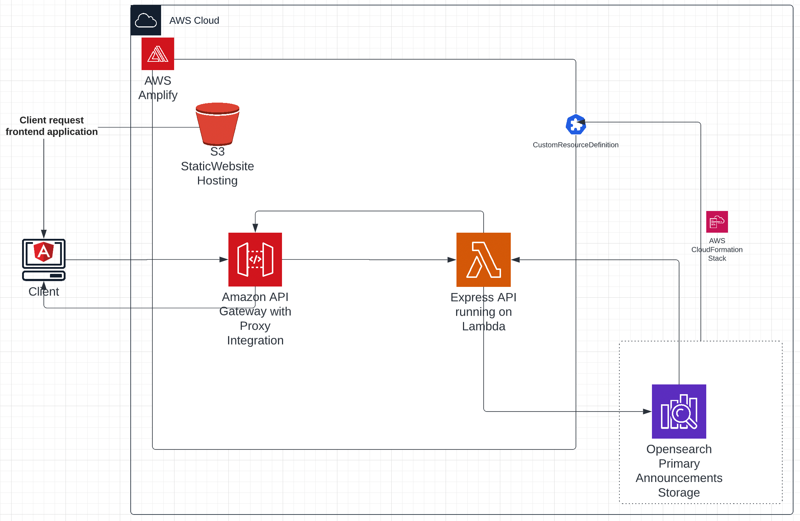
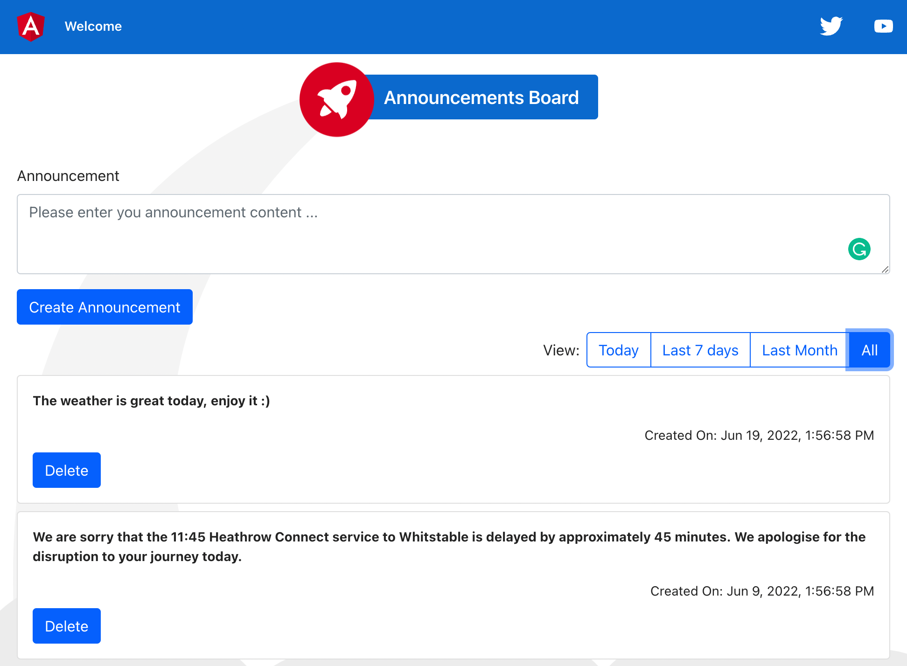

## Announcements Board App

## Installation

### Development setup
1. Install npm in your computer, if you have node installed then most likely you have npm.
2. Run `npm install` inside both the `backend` and `backend` folders.
3. In a terminal window, navigate to the backend directory and run `npm run dev` or `run start`.
Please note that running the app in dev mode will cause the server to reload on code changes
and lose all created in memory data.
4. Open another terminal window and navigate to the frontend directory and run `npm start`
5. Navigate to `http://localhost:4200/` in your browser.
6. You can also run the jasmine tests using `npm test` and run the eslint on all files 
using `npm run lint`

### Docker Setup
1. Install docker on your machine.
2. Build the docker containers of the application frontend and backend using the command `docker compose -f docker-compose-build.yaml build --parallel`
3. Start the application using `docker compose up`
4. Navigate to `http://localhost:8080/` in your browser.

## Proposed deployment architecture on the cloud
In this section, I would like to propose an architecture to deploy the announcements' app. 
The architecture is still not implemented due to time limitation of the task.
I have opted to use AWS Amplify service as an infrastructure bootstrapper of AWS
resources for the following reasons:
1. Amplify makes it easy to compose our architecture serverless components such as s3 buckets 
(including the necessary permissions and website hosting setup), and an API gateway the connects
to a lambda hosting a express server application.
2. I opted for an opensearch based as a source of truth. Opensearch allows extremely fast search
text data such as the announcements contents. I have built the backend to be able to implement 
other storage options via the storage adapter and easily inject the new storage type without 
changing the business logic code in the API endpoints.
3. As a limitation of Amplify, opensearch domains cannot be created with Amplify cli with out 
current service setup, However, the domain can can created as a custom resource in amplify with
the help of CDK or CloudFormation and integrated into amplify backend configuration to make the 
lambda function aware of that domain.
4. With Amplify we get a CI/CD pipeline out of the box. It can be configured to run the backend 
jasmine tests, as well as Cypress E2E tests (e2e tests are not implemented yet).
5. The architecture is highly available and scalable with proper configurations of the opensearch
domain (Availability Zones, instance type, and number of nodes).

   
 

## Screenshot of the running app on the local machinee

 

